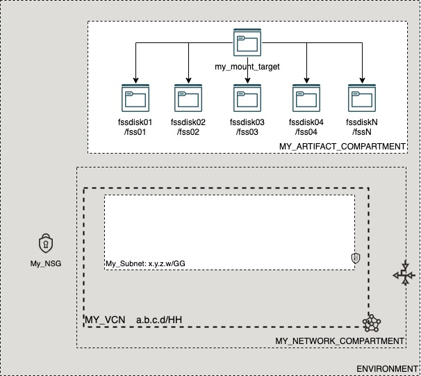

# OCI Cloud Bricks: File System Service (FSS)

[](https://img.shields.io/badge/license-UPL-green) [](https://sonarcloud.io/dashboard?id=oracle-devrel_terraform-oci-cloudbricks-fss)

## Introduction
The following cloud brick enables you to create batches of File Storage Services starting to 1 to many associated to a specific subnet and mount target within a compartment

## Reference Architecture
The following is the reference architecture associated to this brick



### Prerequisites
- A pre-existent VCN
- A pre-existent Mount Target
- A pre existent Compartment Structure

---
## Sample tfvar file
The following is an example tfvar file

```shell
########## SAMPLE TFVAR FILE ##########
########## PROVIDER SPECIFIC VARIABLES ##########
region           = "foo-region-1"
tenancy_ocid     = "ocid1.tenancy.oc1..abcdefg"
user_ocid        = "ocid1.user.oc1..aaaaaaabcdefg"
fingerprint      = "fo:oo:ba:ar:ba:ar"
private_key_path = "/absolute/path/to/api/key/your_api_key.pem"
########## PROVIDER SPECIFIC VARIABLES ##########


########## ARTIFACT SPECIFIC VARIABLES ##########
num_of_fss                           = 2
export_path_base                     = "/fss"
fss_display_name_base                = "fssdisk"
fss_instance_compartment_name        = "MY_ARTIFACT_COMPARTMENT"
fss_network_compartment_name         = "MY_NETWORK_COMPARTMENT"
mt_compartment_name                  = "MY_ARTIFACT_COMPARTMENT"
vcn_display_name                     = "MY_VCN"
network_subnet_name                  = "My_Subnet"
fss_mount_target_availability_domain = "aBCS:RE-REGION-1-AD-1"
fss_mount_target_name                = "my_mount_target"
########## ARTIFACT SPECIFIC VARIABLES ##########
########## SAMPLE TFVAR FILE ##########

```

### Variable specific considerations
- When variable `num_of_fss` is greater than 1, there is a chance that the following error appears:

```shell
Error: 409-Conflict 
 Provider version: 4.40.0, released on 2021-08-18.  
 Service: File Storage System 
 Error Message: Another filesystem is currently being provisioned, try again later 
 OPC request ID: 08cdbcfa22bd1618f7c59b6c784c574d/D0703FEC7507DB939448D64253BBC0F8/AA11BA35A2B6FE2F2B18A25F4BEDF26C 
 Suggestion: The resource is in a conflicted state. Please retry again or contact support for help with service: File Storage System
 
 
   with oci_file_storage_file_system.FileStorage[5],
   on fss.tf line 2, in resource "oci_file_storage_file_system" "FileStorage":
    2: resource "oci_file_storage_file_system" "FileStorage" {
  
```  
  
- If this occurs, be sure to handle a retry logic on code that executes this module at least `num_of_fss + 1 ` times


## Sample provider
The following is the base provider definition to be used with this module

```shell
terraform {
  required_version = ">= 0.13.5"
}
provider "oci" {
  region       = var.region
  tenancy_ocid = var.tenancy_ocid
  user_ocid        = var.user_ocid
  fingerprint      = var.fingerprint
  private_key_path = var.private_key_path
  disable_auto_retries = "true"
}

provider "oci" {
  alias        = "home"
  region       = data.oci_identity_region_subscriptions.home_region_subscriptions.region_subscriptions[0].region_name
  tenancy_ocid = var.tenancy_ocid  
  user_ocid        = var.user_ocid
  fingerprint      = var.fingerprint
  private_key_path = var.private_key_path
  disable_auto_retries = "true"
}
```
---
## Variable documentation
## Requirements

| Name | Version |
|------|---------|
| <a name="requirement_terraform"></a> [terraform](#requirement\_terraform) | >= 0.13.5 |

## Providers

| Name | Version |
|------|---------|
| <a name="provider_oci"></a> [oci](#provider\_oci) | 4.40.0 |

## Modules

No modules.

## Resources

| Name | Type |
|------|------|
| [oci_file_storage_export.ExportFileSystemMount](https://registry.terraform.io/providers/hashicorp/oci/latest/docs/resources/file_storage_export) | resource |
| [oci_file_storage_file_system.FileStorage](https://registry.terraform.io/providers/hashicorp/oci/latest/docs/resources/file_storage_file_system) | resource |
| [oci_core_private_ip.MOUNTPRIVATEIP](https://registry.terraform.io/providers/hashicorp/oci/latest/docs/data-sources/core_private_ip) | data source |
| [oci_core_subnets.SUBNET](https://registry.terraform.io/providers/hashicorp/oci/latest/docs/data-sources/core_subnets) | data source |
| [oci_core_vcns.VCN](https://registry.terraform.io/providers/hashicorp/oci/latest/docs/data-sources/core_vcns) | data source |
| [oci_file_storage_mount_targets.TESTMOUNTTARGETS](https://registry.terraform.io/providers/hashicorp/oci/latest/docs/data-sources/file_storage_mount_targets) | data source |
| [oci_identity_compartments.COMPARTMENTS](https://registry.terraform.io/providers/hashicorp/oci/latest/docs/data-sources/identity_compartments) | data source |
| [oci_identity_compartments.MTCOMPARTMENTS](https://registry.terraform.io/providers/hashicorp/oci/latest/docs/data-sources/identity_compartments) | data source |
| [oci_identity_compartments.NWCOMPARTMENTS](https://registry.terraform.io/providers/hashicorp/oci/latest/docs/data-sources/identity_compartments) | data source |

## Inputs

| Name | Description | Type | Default | Required |
|------|-------------|------|---------|:--------:|
| <a name="input_export_path_base"></a> [export\_path\_base](#input\_export\_path\_base) | Export path for File Storage Service | `any` | n/a | yes |
| <a name="input_fingerprint"></a> [fingerprint](#input\_fingerprint) | API Key Fingerprint for user\_ocid derived from public API Key imported in OCI User config | `any` | n/a | yes |
| <a name="input_fss_display_name_base"></a> [fss\_display\_name\_base](#input\_fss\_display\_name\_base) | User friendly name for File Storage Service | `any` | n/a | yes |
| <a name="input_fss_instance_compartment_id"></a> [fss\_instance\_compartment\_id](#input\_fss\_instance\_compartment\_id) | Defines the compartment OCID where the infrastructure will be created | `string` | `""` | no |
| <a name="input_fss_instance_compartment_name"></a> [fss\_instance\_compartment\_name](#input\_fss\_instance\_compartment\_name) | Defines the compartment name where the infrastructure will be created | `string` | `""` | no |
| <a name="input_fss_mount_target_availability_domain"></a> [fss\_mount\_target\_availability\_domain](#input\_fss\_mount\_target\_availability\_domain) | Availability domain where the mount target is located at | `any` | n/a | yes |
| <a name="input_fss_mount_target_name"></a> [fss\_mount\_target\_name](#input\_fss\_mount\_target\_name) | User friendly name for Mount Target | `any` | n/a | yes |
| <a name="input_fss_network_compartment_name"></a> [fss\_network\_compartment\_name](#input\_fss\_network\_compartment\_name) | Defines the compartment where the Network is currently located | `any` | n/a | yes |
| <a name="input_label_zs"></a> [label\_zs](#input\_label\_zs) | n/a | `list(any)` | <pre>[<br>  "0",<br>  ""<br>]</pre> | no |
| <a name="input_mt_compartment_id"></a> [mt\_compartment\_id](#input\_mt\_compartment\_id) | Mount Target Compartment Location OCID | `string` | `""` | no |
| <a name="input_mt_compartment_name"></a> [mt\_compartment\_name](#input\_mt\_compartment\_name) | Mount Target Compartment Location | `string` | `""` | no |
| <a name="input_network_subnet_name"></a> [network\_subnet\_name](#input\_network\_subnet\_name) | Name of the subnet where the artifact is located | `any` | n/a | yes |
| <a name="input_num_of_fss"></a> [num\_of\_fss](#input\_num\_of\_fss) | Amount of FSS that will be created | `any` | n/a | yes |
| <a name="input_private_key_path"></a> [private\_key\_path](#input\_private\_key\_path) | Private Key Absolute path location where terraform is executed | `any` | n/a | yes |
| <a name="input_region"></a> [region](#input\_region) | Target region where artifacts are going to be created | `any` | n/a | yes |
| <a name="input_tenancy_ocid"></a> [tenancy\_ocid](#input\_tenancy\_ocid) | OCID of tenancy | `any` | n/a | yes |
| <a name="input_user_ocid"></a> [user\_ocid](#input\_user\_ocid) | User OCID in tenancy. Currently hardcoded to user denny.alquinta@oracle.com | `any` | n/a | yes |
| <a name="input_vcn_display_name"></a> [vcn\_display\_name](#input\_vcn\_display\_name) | Display Name associated to VCN | `any` | n/a | yes |

## Outputs

| Name | Description |
|------|-------------|
| <a name="output_FSS"></a> [FSS](#output\_FSS) | FSS Object |
| <a name="output_display_name"></a> [display\_name](#output\_display\_name) | Display Name of FSS |
| <a name="output_export_path_base"></a> [export\_path\_base](#output\_export\_path\_base) | Export path of FSS |
| <a name="output_mount_target_private_ip"></a> [mount\_target\_private\_ip](#output\_mount\_target\_private\_ip) | Private IP of Mount Target |
## Contributing
This project is open source.  Please submit your contributions by forking this repository and submitting a pull request!  Oracle appreciates any contributions that are made by the open source community.

## License
Copyright (c) 2021 Oracle and/or its affiliates.

Licensed under the Universal Permissive License (UPL), Version 1.0.

See [LICENSE](LICENSE) for more details.
